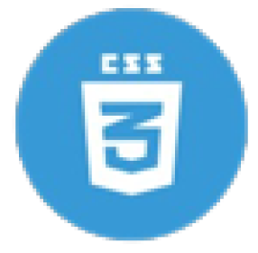
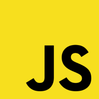
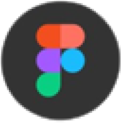
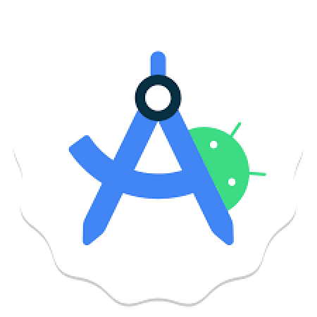
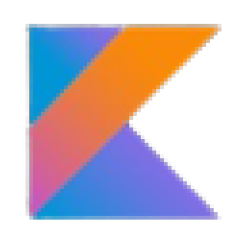
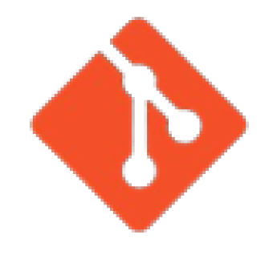
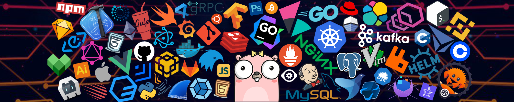

<h3 align="center">

</h3>
 
Welcome to my GitHub profile! 🌟 I’m passionate about coding 💻 and am particularly interested in full stack development 🌐.
 

## About Me

- **💻 Coding Enthusiast:** I love to code and explore new technologies.
- **🌐 Full Stack Development:** I am deeply interested in full stack development and constantly learning to expand my skill set.
- **📚 Learning Web Development:** Currently enhancing my web development skills, working on projects, and applying new knowledge.
- **📈 DSA is Love:** I enjoy solving complex problems and optimizing solutions using data structures and algorithms.
- **🤝 Open Source Contributor:** I like to contribute to open source projects and collaborate with the community.
- **📱 Android Developer Badge Holder:** Proud to have earned my Android Developer Badge, showcasing my skills in Android app development.

## Tech Stack and More

<table style="border-collapse: collapse; border: none; padding: 10px;">
  <tr>
    <td style="vertical-align: top; text-align: center; padding: 10px;">
      
    </td>
    <td style="vertical-align: top; padding: 10px;">
      <table style="border-collapse: collapse; border: none; padding: 10px;">
        <tr>
          <td style="padding: 5px;"></td>
          <td style="padding: 5px;"></td>
          <td style="padding: 5px;"></td>
          <td style="padding: 5px;"></td>
        </tr>
        <tr>
          <td style="padding: 5px;"></td>
          <td style="padding: 5px;"></td>
          <td style="padding: 5px;"></td>
          <td style="padding: 5px;"></td>
        </tr>
        <tr>
          <td style="padding: 5px;"></td>
          <td style="padding: 5px;"></td>
          <td style="padding: 5px;"></td>
          <td style="padding: 5px;"></td>
        </tr>
        <tr>
          <td style="padding: 5px;"></td>
        </tr>
      </table>
    </td>
  </tr>
</table>

## Get in Touch

I’m always open to new opportunities and collaborations. Feel free to reach out if you’d like to work together on projects or simply have a tech discussion!

 

 
 🌐 Let’s connect and create something amazing together.

 <h3 align="center">

</h3>
<h3 align="center"> </h3>
<h3 align="center"> 👇 My Developments 👇 </h3> 
