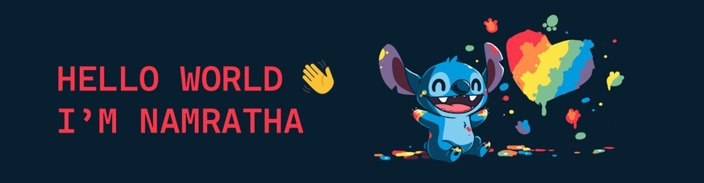

<h3 align="center">

</h3>

Welcome to my GitHub profile! Passionate about coding and am particularly interested in full stack development.

## About Me

- **💻 Coding Enthusiast:** I love to code and explore new technologies.
- **🌐 Full Stack Development:** I am deeply interested in full stack development and constantly learning to expand my skill set.
- **📚 Learning Web Development:** Currently enhancing my web development skills, working on projects, and applying new knowledge.
- **📈 DSA is Love:** I enjoy solving complex problems and optimizing solutions using data structures and algorithms.
- **🤝 Open Source Contributor:** I like to contribute to open source projects and collaborate with the community.
- **📱 Android Developer Badge Holder:** Proud to have earned my Android Developer Badge, showcasing my skills in Android app development.

## Tech Stack and More

  

    <ul style="list-style-type: none;">
      <li> C Language</li>
      <li> Python</li>
      <li> Java</li>
      <li> HTML</li>
      <li> CSS</li>
      <li> Bootstrap</li>
      <li> JavaScript</li>
      <li> Figma</li>
      <li> Android</li>
      <li> Kotlin</li>
      <li> Haskell</li>
      <li> Git</li>
      <li> GitLab</li>
    </ul>
  

  

    
  

## Get in Touch

I’m always open to new opportunities and collaborations. Feel free to reach out if you’d like to work together on projects or simply have a tech discussion!

 🌐 Let’s connect and create something amazing together.

 <h3 align="center">

</h3>
<h3 align="center"> </h3>
<h3 align="center"> 👇 My Developments 👇 </h3> --> 
